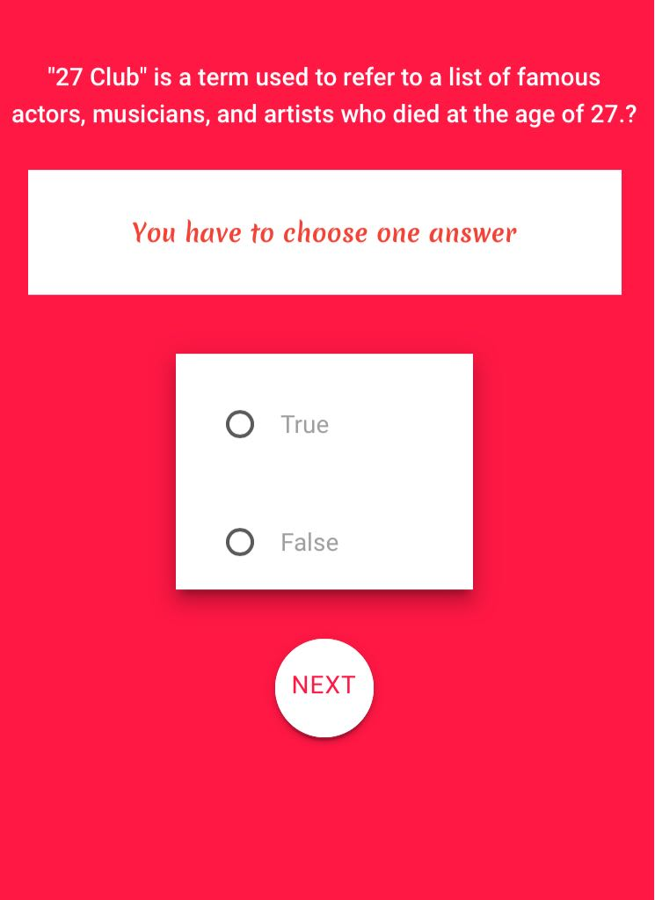

# Test v²

# **opentdb API**
- **PROYECTO EN FIREBASE** -(https://the-v2.firebaseapp.com)

##  **OBJETIVO**
Crear una trivia haciendo uso de la Api

##  **DESARROLLO**

-Es6 Fetch: Para llamar la api
-open Trvia data base API

##Nuestra app se visualiza asi:

.

##  Lenguaje 
- javascript

##  Herramientas

- Html5
- open Trvia data base API
- Jquery

## Autoras

- **Visaka** - [@visidevi](https://github.com/visidevi)

Open source; 2018
